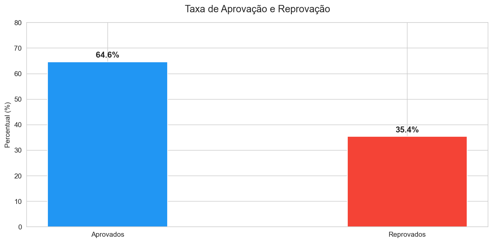
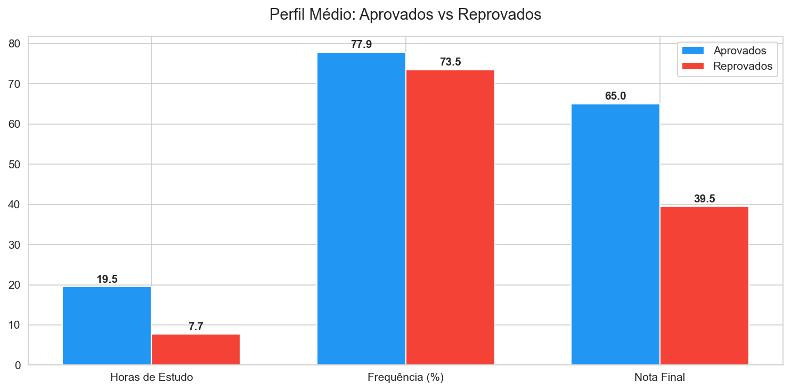
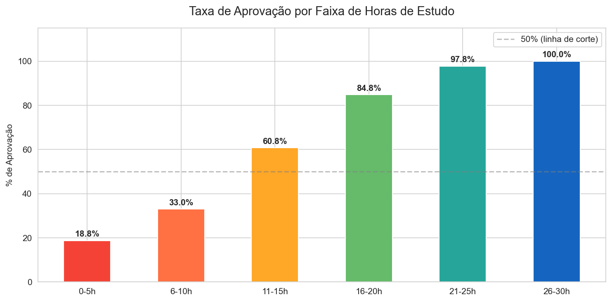
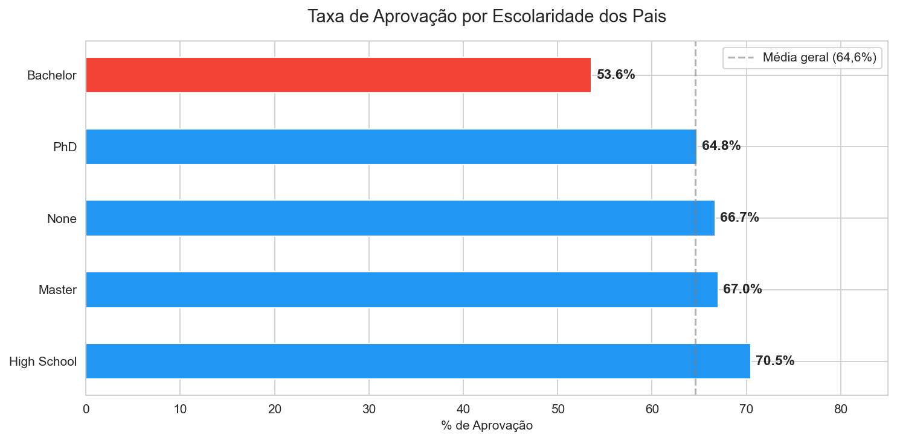
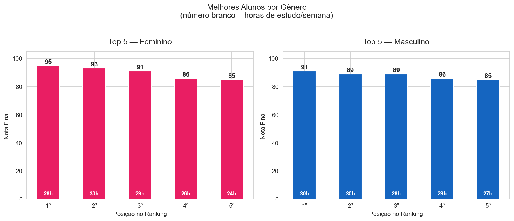
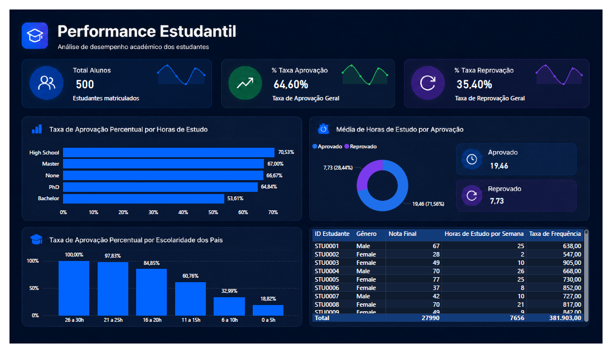

# student-performance-analysis

Análise de desempenho estudantil utilizando SQL, Python e Power BI, com foco na identificação de padrões de aprovação e fatores de risco acadêmico.

[Visualizar Relatório de Insights](https://nicolashovacker.github.io/student-performance-analysis/relatorio_insights.html)

## Resultados e Insights

### Resumo executivo

- A taxa de aprovação é de 64,6%, com mais de um terço dos alunos abaixo do mínimo esperado  
- Horas de estudo são o principal fator de desempenho acadêmico  
- Existe um ponto crítico abaixo de 10h semanais onde a reprovação dispara  
- Fatores externos como escolaridade dos pais e acesso à internet têm baixo impacto  
- Alunos com baixa dedicação e frequência concentram maior risco de reprovação

**Q1 — Taxa geral:**
64,6% aprovados vs 35,4% reprovados. Mais de um terço dos alunos não atingiu os critérios mínimos. 


---

**Q2 — Perfil:**
Aprovados estudam em média 19,5h/semana vs 7,7h dos reprovados. 


---

**Q3 — Ponto de virada:**
Abaixo de 10h semanais a aprovação é de apenas 33%. Acima de 21h, ultrapassa 97%.


---

**Q4 — Evolução:**
61,6% dos alunos pioraram a nota final em relação à anterior. Apenas 1,6% manteve estabilidade.

---

**Q5 — Escolaridade dos pais:**
Sem padrão claro → baixo impacto no resultado.


---

**Q6 — Perfil de Risco:**
Alunos com pouco estudo, baixa frequência e nota anterior baixa concentram os piores resultados.

---

**Q7 — Top performers:**
Os 5 melhores de cada gênero estudam entre 24–30h e têm frequência acima de 90%.


---

**Q8 — Internet/extra:**
Impacto mínimo quando comparado às horas de estudo.

---

## Dashboard Power BI


---

## Estrutura do repositório
```
student-performance-analysis/
├── data/
│   └── raw/
│       └── student_performance.csv
├── graficos/
│   ├── grafico1_aprovacao_geral.png
│   ├── grafico2_perfil_medio.png
│   ├── grafico3_aprovacao_por_horas.png
│   ├── grafico4_escolaridade_pais.png
│   └── grafico5_top_alunos_genero.png
├── notebooks/
│   └── analise_student_performance.ipynb
├── sql/
│   └── 01_analises.sql
├── dashboard/
│   └── dashboard_student_performance.pbix
└── README.md
```
## Progresso do projeto

- [x] Dataset importado e estruturado no SQLite (via DBeaver)
- [x] Análises SQL desenvolvidas (8 queries)
- [x] Integração com Python (Jupyter Notebook)
- [x] Geração de 5 gráficos (.png)
- [x] Dashboard no Power BI
- [x] Documentação final — [Relatório HTML](https://nicolashovacker.github.io/student-performance-analysis/relatorio_insights.html) (gerado com Claude AI)
- [x] README final com prints do dashboard
